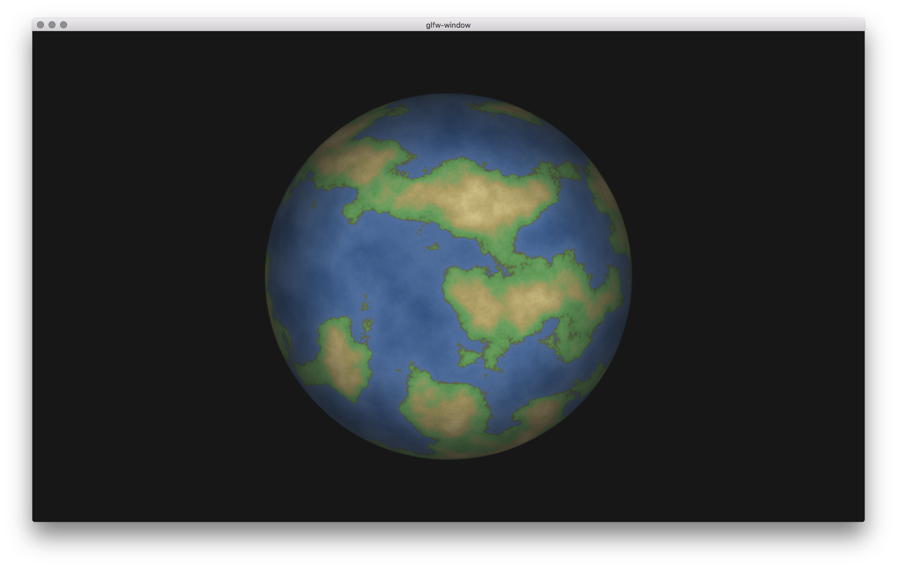

glisy-earth
=================

Glisy example to render
[glsl-earth](https://github.com/mattdesl/glsl-earth) and
[glsl-fog](https://github.com/hughsk/glsl-fog) for fade in effect.



## installation

with clib:

```sh
$ clib install glisy/glisy-earth
$ glisy-earth
```

from source:

```sh
$ make
$ ./program
```

## license

mit
